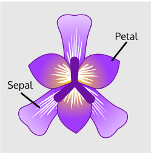
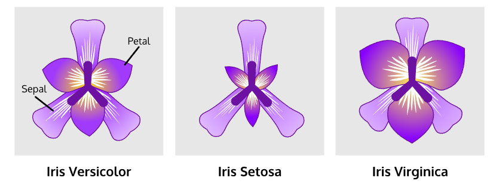

# TASK 1

## AIM

The main aim of this Unsupervised ML is to identify how much much number of clusters (k) in this dataset using K-Means algorithm.

## Information about dataset
Iris is an plant which have 3 different species known as "Iris setosa", "Iris versicolor" and "Iris virginica".

In this dataset we have 4 column which consists:

Column 0: Sepal length
 
Column 1: Sepal width
 
Column 2: Petal length
 
Column 3: Petal width

### Iris Species

### dataset source
dataset: https://archive.ics.uci.edu/ml/datasets/iris
